<h1 align="center">🤝 Adyanta Web App (Client Project)</h1>
<h3 align="center">Adyanta Educational Consultants (Client Project) is an Educational Consultation Website, I successfully developed and deployed 12 unique pages and 20+ dynamic, animated, and reusable components</h3>
 
<p align="center">
  <a href="https://adyanta.co" target="_blank">
    🔗 Live Demo
  </a>
</p>

---

## 📌 Overview

Adyanta (Client Project) is an Educational Consultation Website developed using React/React.JS to bridge the gap between Abroad Future Education Aspirers and the Abroad Education Career Counselors. Here I successfully developed and deployed 12 unique pages and 20+ dynamic, animated, and reusable components establishing a strong core for the website. The entire development process emphasized a mobile-first approach to ensure a seamless user experience across all devices.

---

## 🧠 Website Details

- 🚌 **10,000+** – Professional Courses
- 🧑‍💼 **1000+** – Students Enrolled
- 📍 **1000+** – Certified Institutions
- 📊 **100+** – Foreign Countries
- 📨 **10+** – Years Experience

---

## 🖼️ Screenshots

### Main Home Page:
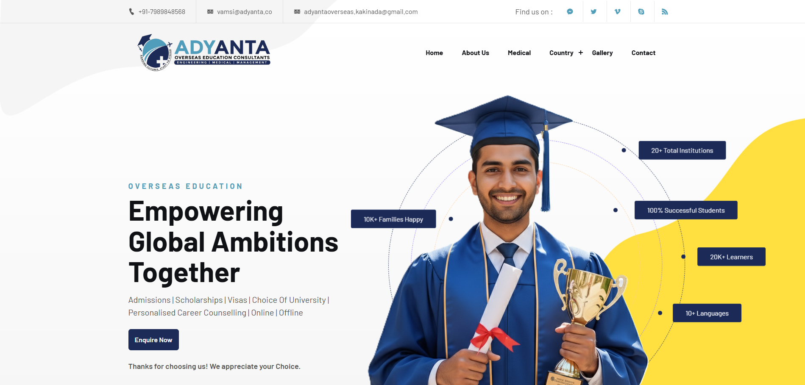

### Streams Offered Component:
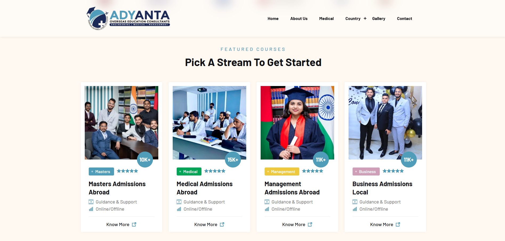

### Facilities Component
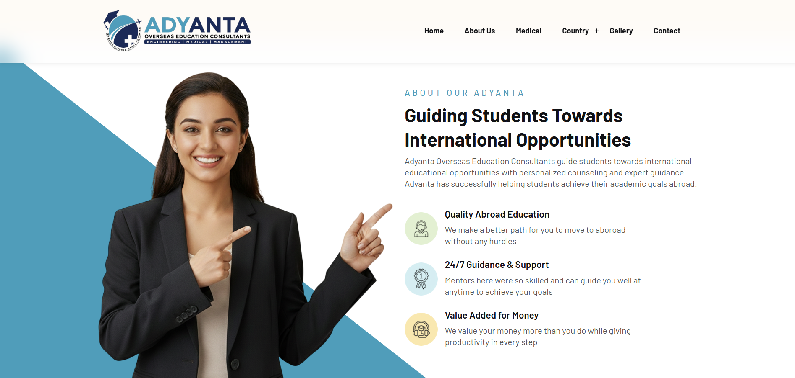

### Instructors Component
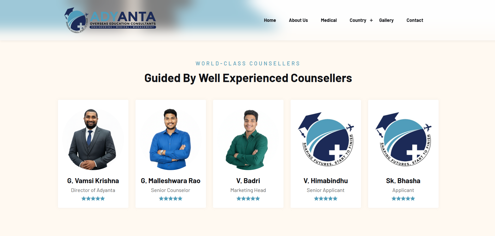

### Footer Component
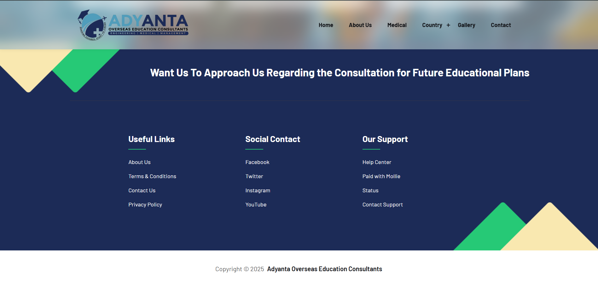

### Offerings Component
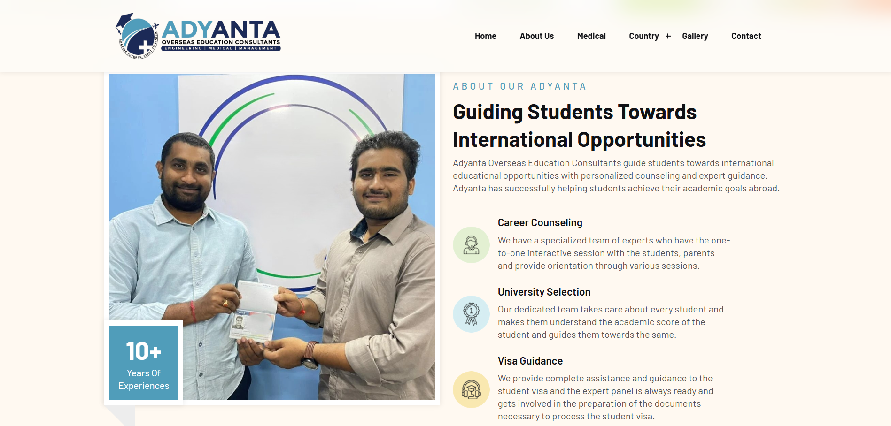

### Unique Loader
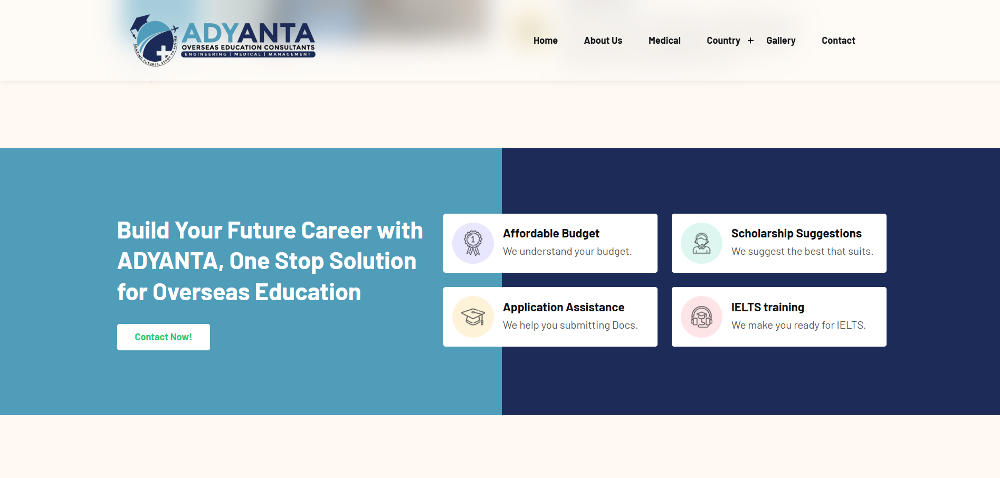

### Medical Home Page
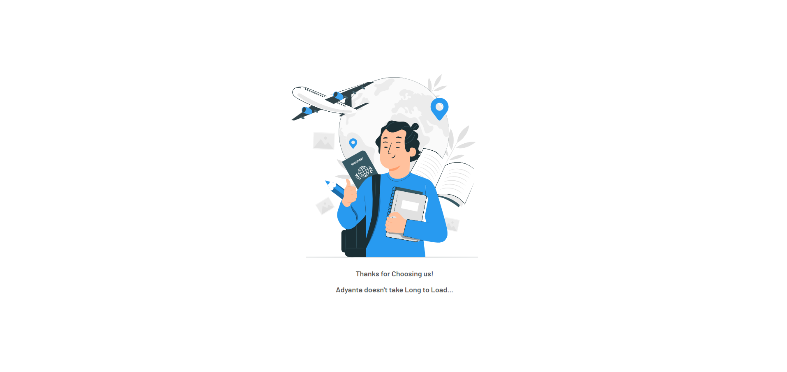

### Medical Universities Page
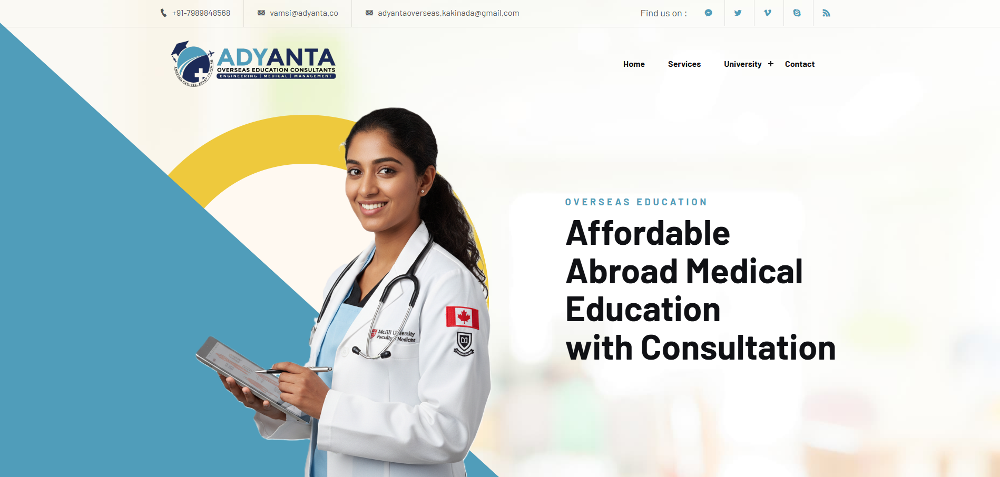

### Medical Page Overview
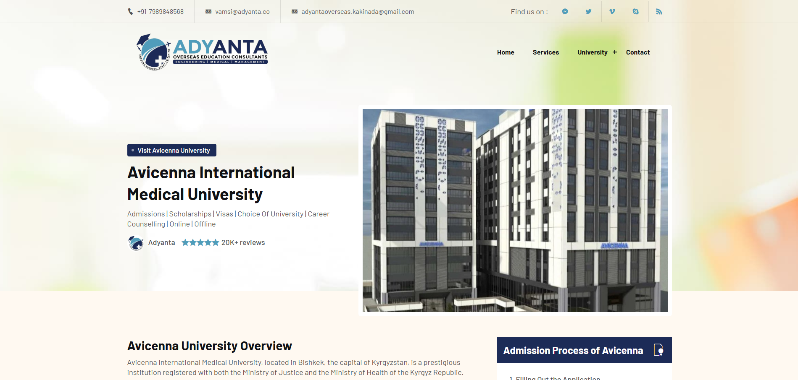

### More Details of Medical Page
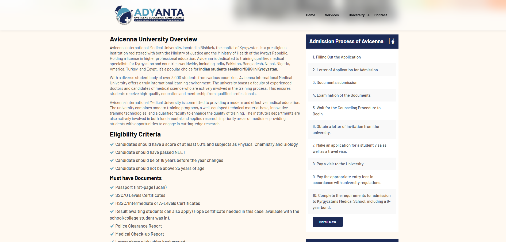

### Services Page
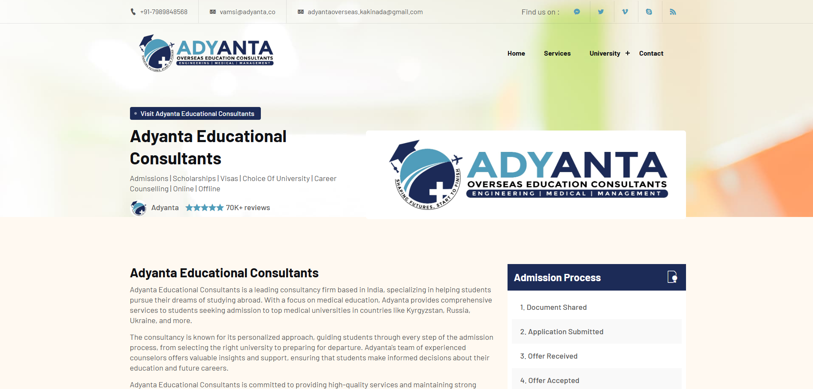

### Services Details
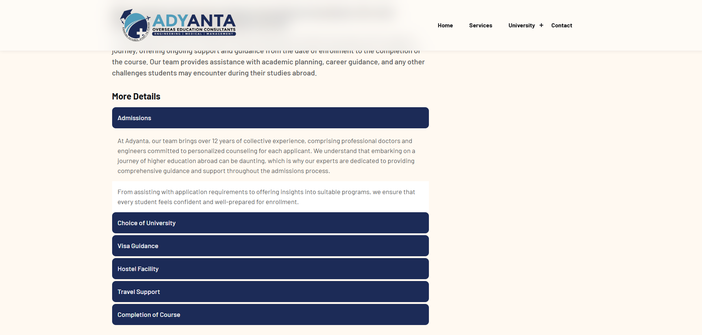

### Contact Us Page
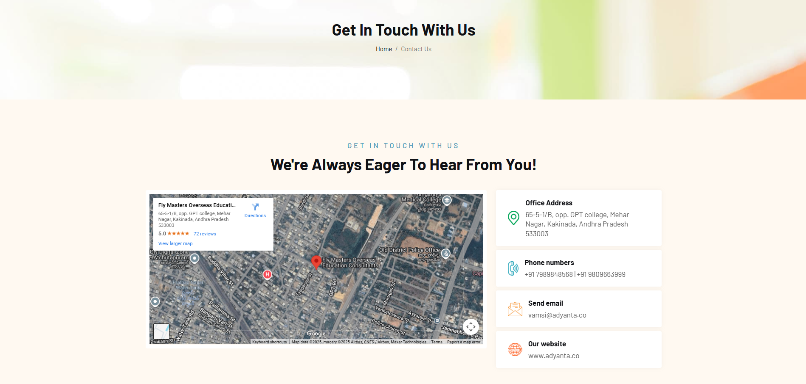

### Contact Form
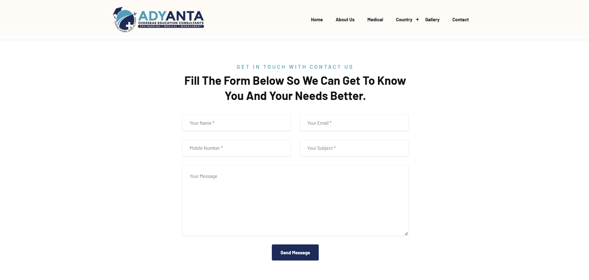

### Coming Soon Page
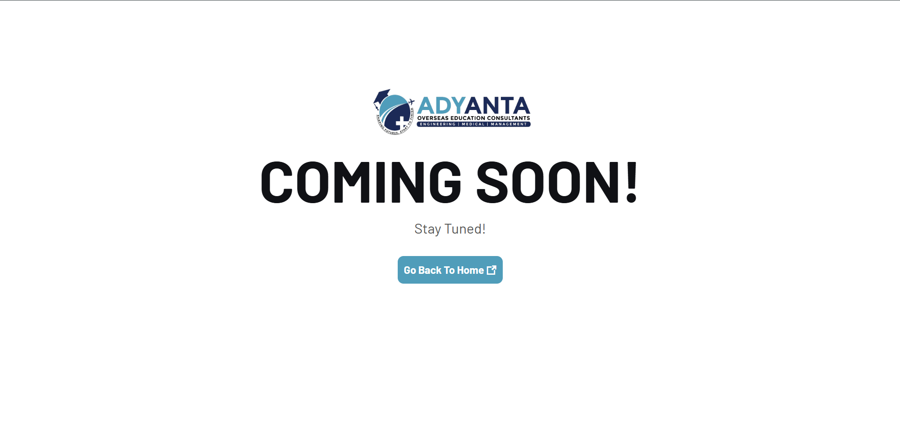

---

## 🔧 Tech Stack

| Technology | Description |
|------------|-------------|
| **Frontend** | React.js, HTML5, CSS3, JavaScript |
| **Hosting Platform** | Hostinger |

---

## 🌐 Live Demo

▶️ [https://adyanta.co](https://adyanta.co)

---

###  Clone the Repository

```bash
git clone https://github.com/nryadav18/adyanta-web-app.git
```

### Install Dependencies
```bash
npm install
```

### Run the Frontend
```bash
npm start
```
